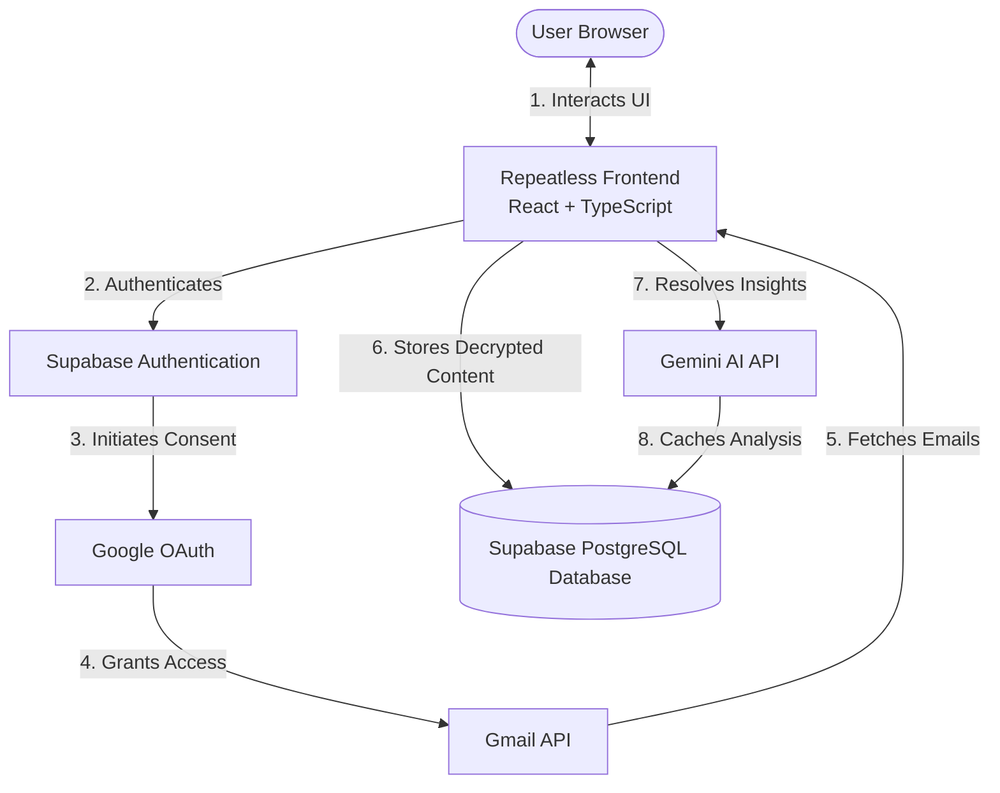
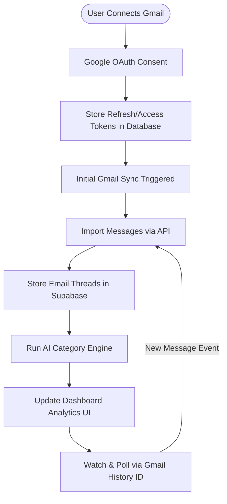
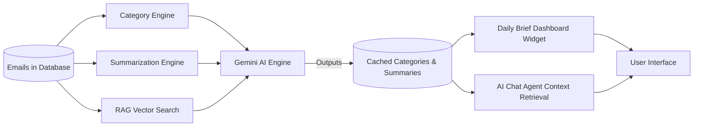
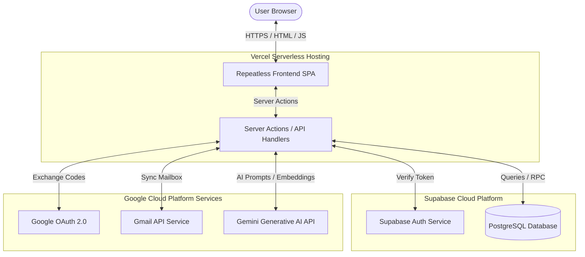

# Repeatless AI — Architecture & Design Document

Repeatless is an intelligent email assistant built on top of Gmail. It categorizes emails, summarizes threads, and hosts an AI Agent capable of answering questions about your correspondence.

---

## 1. Project Overview
Repeatless is a security-conscious web application that connects directly to a user's Gmail mailbox to transform their email workflow. Rather than replacing the user's primary email client, it operates as an intelligence layer on top of it, providing dynamic categorization, automated summarization, smart search, and a natural language chat interface.

## 2. Problem Statement
Modern professionals are overwhelmed by the sheer volume of email they receive daily. Key information is buried in long, fragmented threads, newsletters clutter the main inbox, and extracting actionable decisions or retrieving past discussions requires manual searching. 
Traditional email clients do not analyze or organize content contextually. Repeatless solves this by analyzing the user's mailbox securely and extracting clear takeaways, categories, and action items automatically.

## 3. Key Features
* **Gmail Integration**: Real-time read and write sync (messages, threads, labels, drafts, and send actions) using secure OAuth 2.0.
* **Dashboard Analytics**: Real-time analytics of inbox metrics, including total threads, unread counts, newsletter counts, and category distributions.
* **Email Categorization**: Classifies every thread into a primary context category: *Work, Personal, Finance, Job, Newsletter, or Notification*.
* **AI Agent**: A natural language assistant that queries the user's email history via context-aware vector search.
* **Smart Search**: Contextual search across email subjects, senders, and body text.
* **Newsletter Detection**: Automatically identifies, isolates, and displays newsletters, keeping the primary inbox clutter-free.
* **AI Summaries**: Provides thread-level synthesis, key takeaways, and action items.
* **Gmail Sync**: Seamless synchronization engine that parses messages and updates in the background.

---

## 4. High-Level Architecture

Repeatless AI utilizes a robust serverless architecture that couples a React client interface with a secure Supabase backend and external REST integrations (Gmail API and Gemini AI API).

---

### 1. System Architecture Diagram

**Description**: Shows the high-level transactional and data flow when a user interacts with the Repeatless interface, authenticates, processes mailbox data, and requests AI assistance.

---

### 2. Gmail Synchronization Flow

**Description**: Illustrates the lifecycle of email synchronization, beginning with initial OAuth login and proceeding to raw message ingestion, categorization, dashboard display, and incremental sync updates via Gmail history markers.

---

### 3. AI Processing Architecture

**Description**: Explains the data processing pipeline for email content. Raw database entries are analyzed by the classification, summarization, and query retrieval layers through Gemini to feed the dashboard widgets and chat interface.

---

### 4. Deployment Architecture

**Description**: Details the physical hosting infrastructure, showing how static components, edge serverless routines, databases, and third-party APIs connect securely.

---

## 5. Technology Stack

### Frontend & Client Environment
* **React 19**: Core UI rendering framework.
* **TypeScript**: Strict type validation.
* **Tailwind CSS**: Utility-first CSS framework for modern, harmonized styling.
* **TanStack Router & Start**: Filesystem routing and server-side functions.
* **TanStack React Query (v5)**: Declarative, robust data fetching and state caching.

### Backend & Storage
* **Supabase**: Hosted PostgreSQL database.
* **Row-Level Security (RLS)**: Secures all user data so that a user can only query their own emails and credentials.
* **Database Tables**:
  * `users`: Main user records.
  * `gmail_accounts`: Stored OAuth credentials and sync status per user.
  * `emails`: Upserted unique Gmail message rows.
  * `email_categories`: Categorization cache.
  * `email_summaries`: Cached summary and action item details.

### Integrations
* **Google Gmail API**: Fetches and modifies raw user emails.
* **Gemini Pro (Google Generative AI)**: Generates daily briefings, thread summaries, embeddings, and chat agent responses.

---

## 6. Design Decisions
* **Direct Database Queries over Dynamic Fetching**: Fetching thousands of emails dynamically from Gmail API on every page load causes excessive loading times. Repeatless stores synced records in PostgreSQL, allowing fast, parallel inner joins that return counts and listings in **< 600ms**.
* **TanStack React Query**: Simplifies frontend state management, handles query invalidations, and avoids the overhead of Redux or Zustand for data-driven routes.
* **Quota Circuit Breaker**: Google Gemini free-tier accounts have tight rate limits. The custom in-memory circuit breaker prevents the UI from freezing or generating continuous terminal errors, switching off calls during rate-limit cooldowns.

---

## 7. Security Considerations
* **OAuth Scope Minimization**: Requests only Gmail read-write scopes (`gmail.modify` and `gmail.send`) required for syncing and drafting, without accessing full Google account security settings.
* **Secure Token Storage**: Encrypts and saves OAuth refresh/access tokens in a secure table protected by PostgreSQL RLS.
* **Frontend Memory Flushing**: Logging out clears all local caches, resets standard sessions, wipes `localStorage`/`sessionStorage` (preserving only theme preference), and uses a global `pageshow` listener to automatically evict access to the dashboard from the browser's back-forward cache (bfcache).

---

## 8. Limitations
* **Gemini API Limits**: The application uses the Gemini API for intelligence features. Under heavy traffic or bulk syncing, rate limits (HTTP 429) may be reached. The application handles this gracefully by displaying cached data and warning the user.
* **Single Mailbox Integration**: Currently supports linking one Gmail account per Supabase user session.

---

## 9. Future Improvements
* **Real-time Push Notifications**: Integrating Google Cloud Pub/Sub webhooks to trigger instant background synchronization on new email arrivals rather than relying on interval polling.
* **Vector Embeddings Indexing**: Rebuilding full vector databases inside PostgreSQL (`pgvector`) for every user email, enabling deep context queries.
* **Multi-Account Support**: Allowing users to link multiple Gmail mailboxes and view them in a unified interface.
