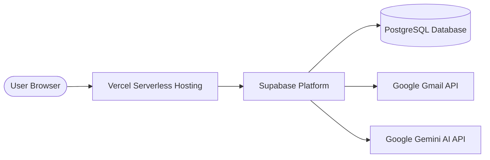
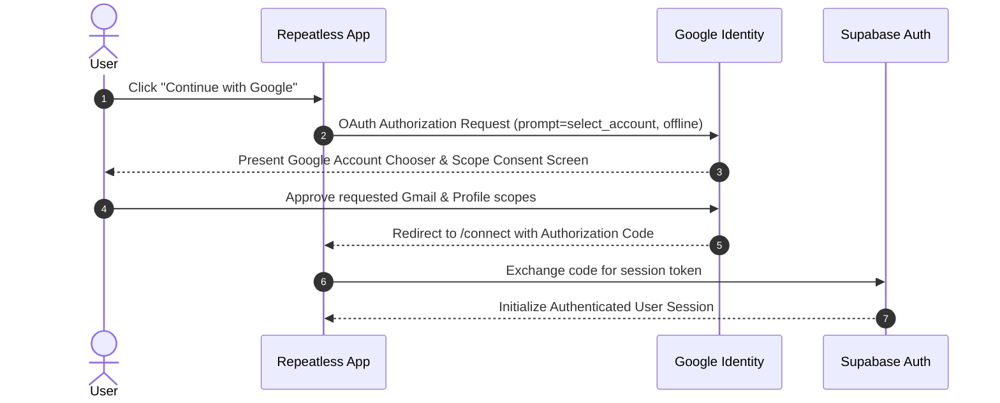
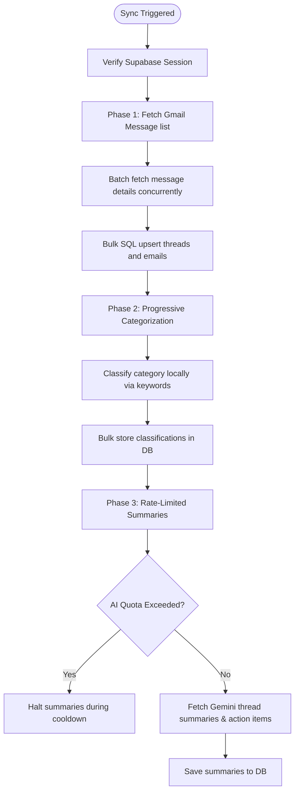
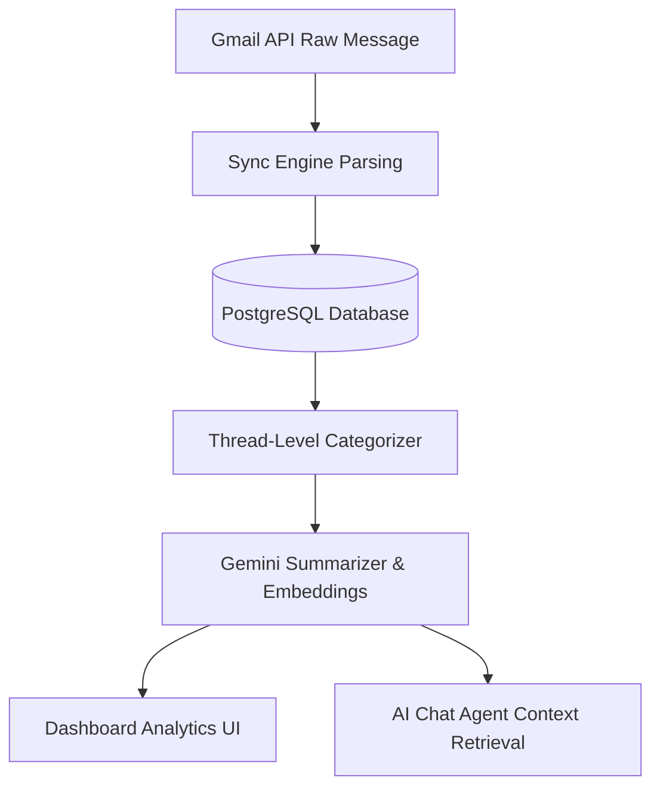
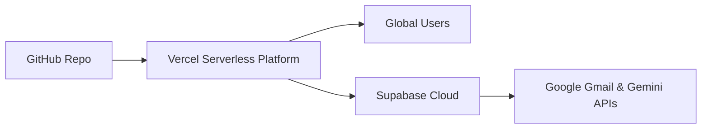

# Repeatless AI – Architecture & Design Document

Repeatless is an intelligent, privacy-focused email layer built on top of Google Gmail. By coupling high-performance synchronization, metadata indexing, and the Google Gemini generative model, Repeatless converts sprawling, cluttered inboxes into structured summaries, context-aware categories, newsletter feeds, and a conversational natural language chat interface.

---

## 1. Project Vision

Traditional email clients treat correspondence as isolated, sequential items. Users spend substantial mental energy scanning subject lines, tracking multi-party discussion threads, searching for buried invoices, and manually isolating newsletter subscriptions.

**Repeatless** changes this paradigm by behaving as a secure intelligence overlay. It is designed to:
- **Minimize Overhead**: Automatically summarize long threads into bulleted decisions and action items.
- **Group Contextually**: Classify mailboxes into functional spaces (*Work, Personal, Finance, Job, Newsletter, Notification*).
- **Interact Conversationally**: Enable users to chat directly with their mailbox history using a context-aware AI agent.
- **Maintain Total Privacy**: Keep credentials and data protected using secure PostgreSQL Row Level Security (RLS) and environment variable constraints.

---

## 2. Requirements

### Functional Requirements
- **Secure Google OAuth 2.0 Auth**: Sign in and establish least-privilege Gmail API permissions.
- **Full Mailbox Sync Engine**: Fetch, index, and cache messages, threads, labels, drafts, and sent items.
- **Deterministic and AI Categorization**: Fast, keyword-based local classification and fallback to LLM classification.
- **Thread-Level Aggregation**: Group messages into threads, compiling summaries and actionable bullet lists dynamically.
- **AI Chat Agent**: Parse user queries and search email history using contextual vector similarity and database retrievals.
- **Newsletter Feed Isolation**: Automatically detect newsletter issues and move them into a dedicated dashboard feed to maintain a zero-distraction Primary Inbox.

### Non-Functional Requirements
- **High Performance**: Dashboard load times and inbox counts resolve in `< 600ms` via direct PostgreSQL indexing and parallel queries.
- **AI Rate-Limit & Quota Protection**: An active in-memory circuit breaker that detects Gemini rate limits (HTTP 429) and halts retry storms.
- **Security & Privacy**: Zero storage of raw user passwords, environment-secured credentials, and complete local session wiping on logout.
- **Responsive Premium Design**: Curated, harmonious color system (light ivory design system) with subtle micro-animations.

---

## 3. High-Level Architecture

The system is built on a serverless, decoupled stack linking a modern TypeScript frontend to a hosted BaaS (Backend-as-a-Service) database and REST-based intelligence services.

---

## 4. System Components

1. **Client Application (TanStack Start & React)**: Houses the UI layout, routing schema, state managers (TanStack React Query), and visual components.
2. **Server Actions (Server-Side Vinxi Handlers)**: Executes secure server-only functions (Gmail API token exchanges, DB mutations, Gemini API queries) that are stripped from the browser bundle during compilation.
3. **Database (Supabase PostgreSQL)**: Stores accounts, email metadata, categorizations, thread summaries, and chat histories. It enforces strict Row Level Security (RLS) so users can only access records matching their `auth.uid()`.
4. **Gmail Sync Engine**: Coordinates concurrent page detail retrievals and performs bulk SQL upserts to minimize network roundtrips.
5. **AI Processing Pipeline**: Manages generative summarization, daily briefs, embedding generation, and chat reasoning using the Gemini Pro API.

---

## 5. System Workflows & Pipelines

### A. Gmail OAuth 2.0 Authentication Flow
To secure user mailboxes, authentication relies on a multi-step OAuth handshake. Google accounts chooser is forced on every attempt to allow switching profiles, and offline refresh tokens are securely stored in the DB.

### B. Gmail Synchronization Workflow
Mailbox data is ingested via an incremental, phased synchronization pipeline designed to bring in threads rapidly and run AI processes in the background.

### C. Email Processing Pipeline
Raw email content moves through several extraction and optimization steps before appearing on the user's dashboard and being indexed for AI query retrieval.

### D. Deployment Architecture
Physical deployment is structured to ensure global edge execution, database scalability, and strict environment configuration.

---

## 6. Security Design

- **Row-Level Security (RLS)**: Enforced globally on all tables. A user's query is scoped to their authenticated ID. It is physically impossible to view or alter another user's emails or OAuth tokens.
- **Least-Privilege Scopes**: The application requests access strictly to read, modify, and compose Gmail messages (`gmail.modify` and `gmail.send`) without access to full Google Account admin settings.
- **Safe Environment Variables**: Secrets such as `GOOGLE_CLIENT_SECRET`, `SUPABASE_SERVICE_ROLE_KEY`, and `GEMINI_API_KEY` are kept on Vercel or in local `.env` files. They are never committed to git.
- **Client Session Eviction**: Clicking "Log Out" clears all cookies, browser `localStorage`/`sessionStorage` states, and resets the React Query cache. A global `pageshow` listener detects if the page was loaded from the browser's back-forward cache (bfcache) and immediately redirects unauthorized back-navigation.

---

## 7. Design Decisions & Trade-Offs

### Why TanStack Start & Router?
- **Benefits**: Combines clean file-based routing with typesafe server actions. It bridges the gap between client component responsiveness and secure serverless operations without requiring a separate server configuration.
- **Trade-off**: Requires strict dynamic loading boundaries to prevent server libraries (like `@tanstack/react-start/server`) from leaking into client-side JS bundles.

### Why Supabase?
- **Benefits**: Provides rapid database deployment with built-in user authentication, Go-like PostgREST APIs, and robust row-level security policy configurations.
- **Trade-off**: Heavily dependent on Postgres constraints; requires clean SQL indexing and schema configurations to optimize performance.

### Why Google Gemini?
- **Benefits**: Offers high-quality generative models with strong summarization capabilities and massive token windows. It is native to the Google Cloud ecosystem, matching the Gmail provider context.
- **Trade-off**: Free-tier API keys face strict requests-per-minute limits, necessitating the implementation of our custom Quota Circuit Breaker.

### Why PostgreSQL?
- **Benefits**: Relational structures match Gmail's thread-to-message structure perfectly. Supports high-performance parallel inner joins and contains vector extension capabilities (`pgvector`) for native semantic search.

---

## 8. Future Improvements

1. **Real-time Push Hooks**: Integrate Google Cloud Pub/Sub webhooks to run background synchronization instantly upon receiving a message, replacing the need for periodic manual refreshes.
2. **Native pgvector RAG**: Store AI email embeddings directly in a Postgres vector column and utilize Cosine Similarity queries to power the AI Agent, streamlining the retrieval engine.
3. **Unified Multi-Mailbox View**: Expand the schema to allow a single user to link multiple Google profiles and query them collectively.
