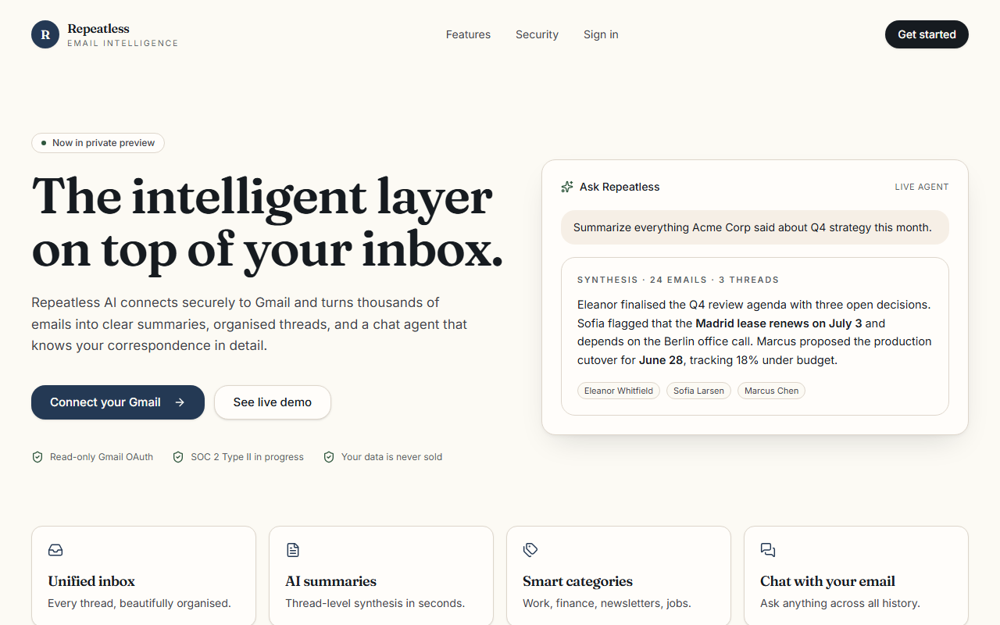
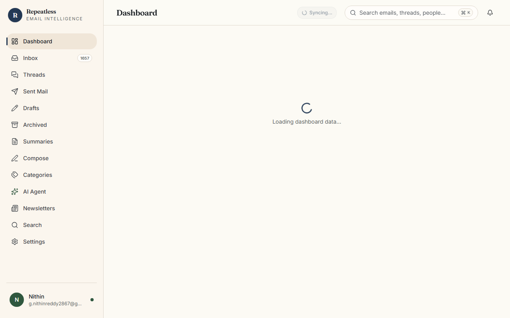
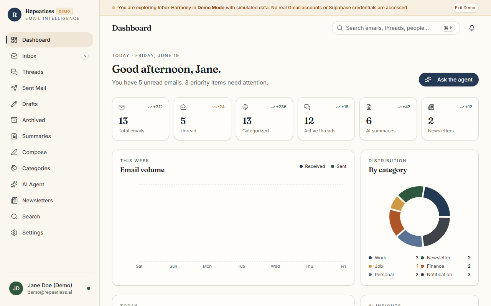
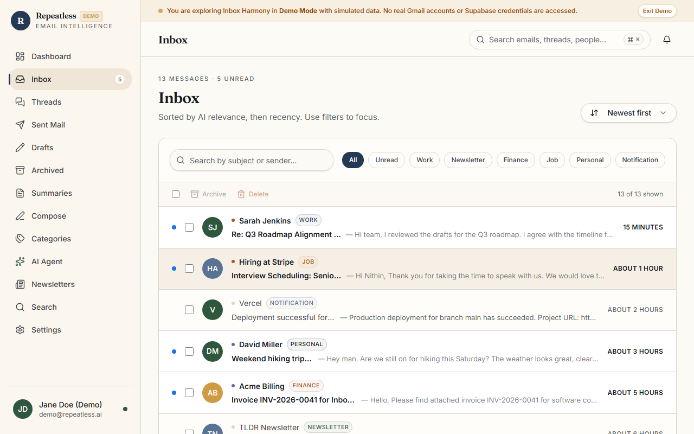
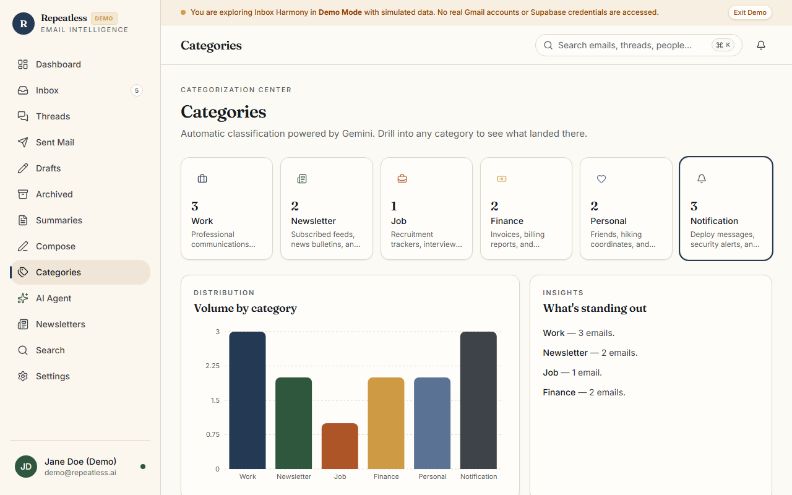
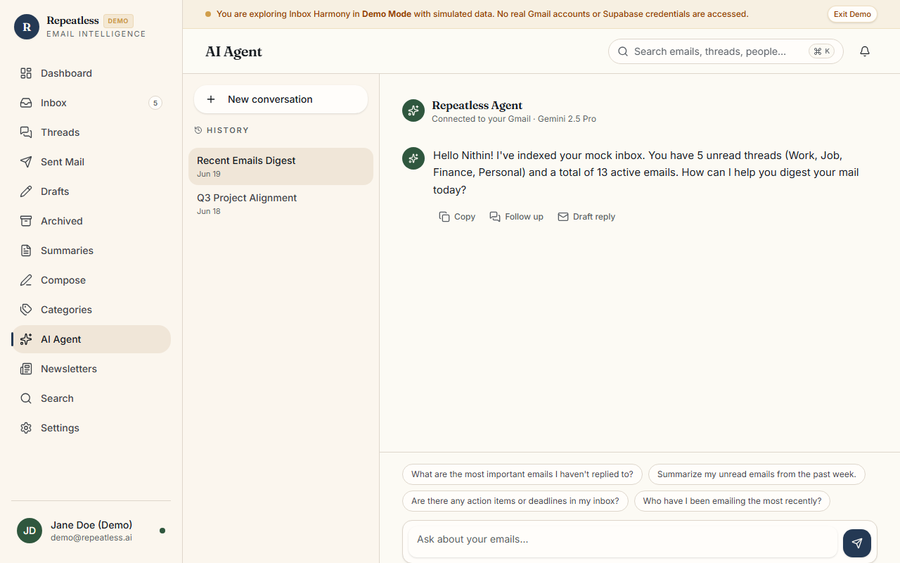
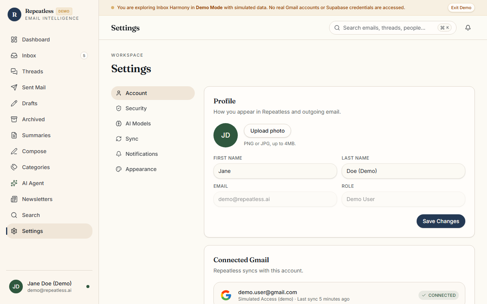
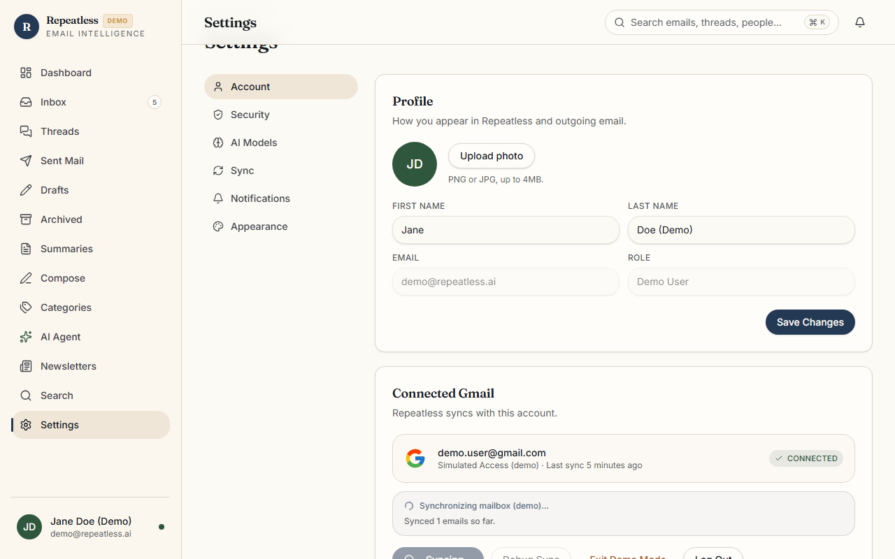

# Repeatless – AI-Powered Email Intelligence Platform

Repeatless is a privacy-first, secure email intelligence overlay for Google Gmail. It is designed to index mailboxes, isolate subscription clutter, compile actionable thread-level summaries, and expose a natural language chat interface—transforming unstructured mailboxes into searchable, context-aware workspaces.

---

## 🔗 Project Links

- **Live Demo**: [https://repeatless-email-intellegance.vercel.app](https://repeatless-email-intellegance.vercel.app)
- **GitHub Repository**: [https://github.com/NithinReddyGuvvala/Repeatless-Email-Intellegance.git](https://github.com/NithinReddyGuvvala/Repeatless-Email-Intellegance.git)

---

## ✨ Features

- 🔑 **Gmail OAuth Authentication**: Seamless sign-in using Google's official OAuth 2.0 flow with dynamic account selector consent.
- 🛡️ **Secure Account Linking**: High-security session creation storing encrypted offline access and refresh tokens.
- 🔄 **Inbox Synchronization**: Background sync pipeline with concurrent message fetching and batch SQL operations.
- 📝 **AI Email Summaries**: Instant bullet points outlining key takeaways, decisions, and action items for individual messages and threads.
- 🏷️ **Smart Categorization**: Classifies every thread into primary context buckets (*Work, Personal, Finance, Job, Newsletter, Notification*).
- 💬 **Conversational AI Agent**: Natural language assistant leveraging context retrieval for answering detailed queries about your mailbox history.
- 📈 **Dashboard Analytics**: Real-time analytics detailing unread metrics, category ratios, newsletter counts, and daily briefing widgets.
- 🔍 **Unified Search**: Search across subjects, senders, and body texts utilizing indexed database queries.
- ⚙️ **Profile & Settings Management**: Manage user preferences, view synchronization logs, switch accounts, and disconnect Google access.
- 📊 **Multi-step Sync Tracking**: Visual step indicators detailing incremental stages of message ingestion.

---

## 📷 Screenshots

### Landing Page


### Login Screen


### Dashboard


### Inbox


### Categories


### AI Agent


### Settings / Connected Gmail


### Gmail Sync Progress


---

## 💻 Tech Stack

### Frontend
- **Framework**: React 19 (Single Page Architecture)
- **Routing**: TanStack Router (Typesafe File-based routing)
- **Data Fetching**: TanStack React Query v5 (Declarative state caching)
- **Styling**: Tailwind CSS
- **Typing**: TypeScript

### Backend & Middleware
- **Database & Auth**: Supabase (BaaS PostgreSQL)
- **Server Handlers**: TanStack Start Server Actions (Vinxi RPC boundary)

### Security & Integrations
- **Authentication**: Google OAuth 2.0 & Supabase Auth
- **AI Engine**: Google Gemini Pro (Summarization, briefing, and chat agent)
- **Hosting**: Vercel

---

## 🔒 Security & Privacy

Repeatless has been audited to eliminate hardcoded credentials and strictly adheres to standard security compliance policies:

- **OAuth 2.0 Protocol**: Google OAuth handles credentials. Repeatless never sees, prompts for, or stores your Google password.
- **Least-Privilege Gmail Access**: Requests are restricted to the minimal scopes (`gmail.modify` and `gmail.send`) required for mailbox operations.
- **Secure Secret Handling**: Environment variables secure server-side keys. No secrets are committed to GitHub.
- **Automatic Session Eviction**: Logging out clears user cookies, wipes local/session caches, and intercepts browser back-button caching (bfcache) to prevent unauthorized view restores.
- **Environment Isolation**: PostgreSQL Row Level Security (RLS) protects tables, guaranteeing users can only access their own synchronized data.

### Trust Badges
🔒 **OAuth 2.0 Protected** &nbsp;|&nbsp; 🛡️ **Environment Variable Secured** &nbsp;|&nbsp; 📧 **Read-only Gmail Access** &nbsp;|&nbsp; 🚫 **No Hardcoded Secrets** &nbsp;|&nbsp; ☁️ **Secure Vercel Deployment**

---

## 🚀 Setup Instructions

### Prerequisites
Ensure you have the following installed or configured:
- **Node.js** (v18 or higher)
- **npm** (v9 or higher)
- **Supabase Project** (database instance with Google OAuth enabled)
- **Google Cloud Platform Project** (Gmail API enabled and credentials created)
- **Google Gemini API Key**

---

### Installation

1. **Clone the repository**:
   ```bash
   git clone https://github.com/NithinReddyGuvvala/Repeatless-Email-Intellegance.git
   cd Repeatless-Email-Intellegance
   ```

2. **Install project dependencies**:
   ```bash
   npm install
   ```

---

### Environment Variables
Create a `.env.local` file in the project root:
```env
# Supabase Configuration
VITE_SUPABASE_URL=https://your-project-ref.supabase.co
VITE_SUPABASE_ANON_KEY=your-anon-key
SUPABASE_SERVICE_ROLE_KEY=your-service-role-key

# Google OAuth Credentials
GOOGLE_CLIENT_ID=your-google-client-id
GOOGLE_CLIENT_SECRET=your-google-client-secret

# Google Gemini AI Key
GEMINI_API_KEY=your-gemini-api-key

# Vercel Configuration
VERCEL_URL=your-vercel-domain
```
> [!WARNING]
> Do not commit `.env.local` or environment keys to your code repository. Ensure `.env.local` is present in `.gitignore`.

---

### Running Locally

1. **Start the development server**:
   ```bash
   npm run dev
   ```
2. Open your browser and navigate to `http://localhost:3000`.

---

### Production Build

1. **Compile and compile production bundles**:
   ```bash
   npm run build
   ```

2. **Preview the production server locally**:
   ```bash
   npm start
   ```

---

### ☁️ Vercel Deployment

1. **Import the repository** into the [Vercel Dashboard](https://vercel.com).
2. **Add Environment Variables**: Paste all variables from `.env.local` under Project Settings -> Environment Variables.
3. Configure the **Build Settings**:
   - Framework Preset: **Other** / Auto-detected
   - Build Command: `npm run build`
   - Output Directory: `.output`
4. **Deploy**: Click Deploy to launch the platform.
